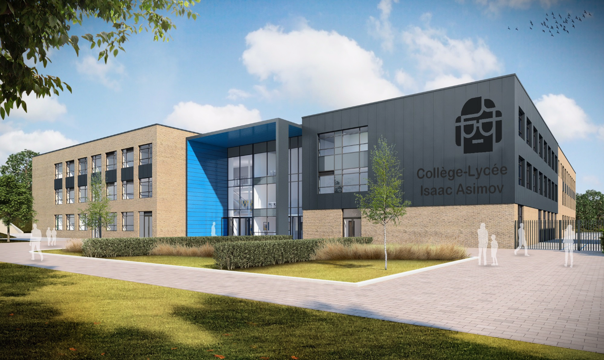

# Asimov

    

------------------------------------------------------------------------------------------------------------
# PROJET

Projet scolaire.

__Contexte :__

+ La fondation souhaite qu'un logiciel de suivi des élèves soit mis en place. Le premier concept est
+ l'usage de pourcentage de réussite plutôt que des notes sur 20.
+ Le développement de cette application doit se faire en toute indépendance des systèmes scolaires
+ actuels (ENT, Pronote, Ecole Directe). Lors de l'appel d'offre, votre société a été retenue pour répondre
+ au cahier des charges.
------------------------------------------------------------------------------------------------------------

# ORGANISATION

__Maquettes et diagrammes du projet :__

+ <a href="https://www.figma.com/file/iJmWt1UoXcVjCN1yeOwLkA/projet-ASIMOV?node-id=0%3A1&t=G0LwdWmhbfUvFLgC-1">Maquette et diagrammes sur Figma<a>

 

__Motif d'architecture logicielle :__
+ Architecture Modèle/Vue/Contrôleur (MVC)

 

<u>J'ai choisie les technologies suivantes:</u>

__Front-End :__
+ Le framework Bootstrap 5

__Back-End :__
+ Le framework NodeJS
+ Le framework ExpressJS

__Gestion BDD :__
+ SQL sous PHPMyAdmin

------------------------------------------------------------------------------------------------------------

Ce projet est réalisé par : [Rhizlène ALFARDOUS](https://github.com/Rhizlene)
